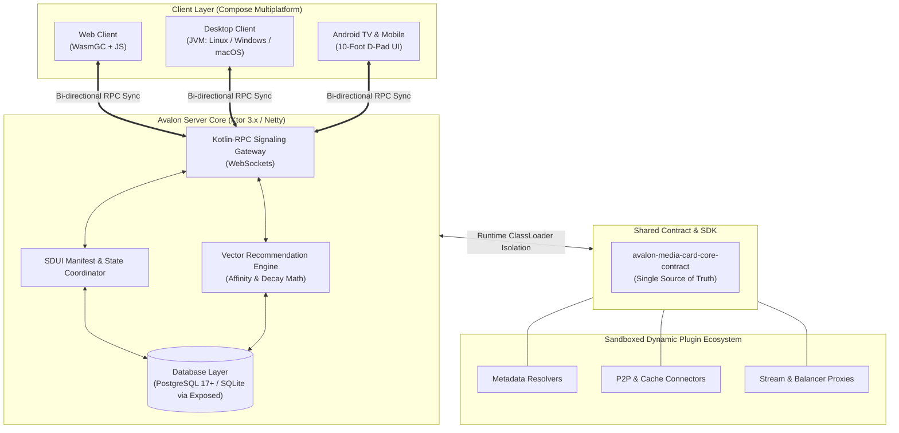

# 📐 Avalon MediaCard — Architecture & Engineering Deep Dive

<p align="center">
  <strong>English</strong> • <a href="ARCHITECTURE.ru.md">Русский</a>
</p>

This document provides a comprehensive breakdown of the internal architectural patterns, system topology, multi-engine video rendering matrix, and engineering principles behind **Avalon MediaCard**.

---

## 🏛️ High-Level System Architecture

Avalon MediaCard is structured around **Clean Architecture** principles across a unified **Kotlin Multiplatform (KMP)** codebase:



---

## 🎬 Universal Multi-Engine Video Player Matrix

Traditional media centers (like Plex or Jellyfin) often place heavy CPU transcoding loads on the host server to convert video formats, audio codecs, or burn in styled `.ass/.ssa` subtitles.

Avalon fundamentally changes this paradigm by using **Zero-Server-Transcoding Architecture**: 100% of media rendering and stream decoding is offloaded to client hardware using platform-native player engines:

| Target Platform | Core Engine | Hardware Acceleration | Subtitle Rendering | Key Technical Capabilities |
|---|---|---|---|---|
| **Desktop**<br/>*(Linux / Windows / macOS)* | **LibMPV**<br/>*(via JNA C-Interop)* | VAAPI, NVDEC, D3D11VA, VideoToolbox | Native Pixel-Perfect ASS/SSA | Zero-overhead JNA memory bridging, HDR tone mapping, seamless multi-audio track switching, unlimited codec support. |
| **Android & Android TV**<br/>*(Mobile, Tablet, TV)* | **AndroidX Media3**<br/>*(ExoPlayer + FFmpeg Extensions)* | Android MediaCodec API | Media3 Native + Custom Overlay | **100% D-Pad Remote Optimization**, Leanback 10-foot UI, bundled FFmpeg audio/video extensions, optional LibVLC/MPV fallbacks. |
| **Web**<br/>*(WasmGC & Modern Browsers)* | **PlaysVideo / Mediabunny**<br/>*(HLS, DASH, MPEG-TS, MP4)* | WebGL / Canvas Direct Draw | WebVTT / ASS.js Canvas | **In-Browser Wasm-FFmpeg Transcoder:** Real-time Web Worker pipeline converting HEVC/AC3/E-AC3/DTS directly in browser with **zero server load**. |

---

## 🖥️ Server Layer (Backend)

* **Engine & Transport:** **Ktor 3.x** on Netty engine with bi-directional **Kotlin-RPC (`kotlinx-rpc`)** over WebSockets.
* **Database & ORM:** SQLite / PostgreSQL 17+ accessed via **JetBrains Exposed ORM** with asynchronous `newSuspendedTransaction(Dispatchers.IO)`. Coroutines are never blocked by database calls.
* **Mathematical Vector Recommendation Engine:** Calculates multidimensional user affinity vectors across genres, tags, directors, actors, release eras, pacing, and mood tropes. Integrates exponential time decay for older viewing history and a serendipity factor to curate dynamic home discovery shelves.
* **Watch Party Synchronization Engine:** Manages multi-user co-viewing rooms with state sync (anchor position, play/pause state, ping compensation) and a pre-launch lobby with intent badges (*"Silent viewing"*, *"Ready to talk"*).

---

## 🧩 Plugin Runtime Isolation

The server dynamically loads plugins from the `plugins/` directory at startup or via hot-reload through the admin panel:
1. Each `.jar` plugin is instantiated within its own dedicated `URLClassLoader` child instance.
2. Plugins conform to the [`avalon-media-card-core-contract`](https://github.com/ensodai/avalon-media-card-core-contract) interfaces (`AvalonPlugin`, `PluginContext`).
3. If a third-party plugin encounters an uncaught exception, its isolation boundary prevents server-wide crashes.
4. Hot-reloading unloads the plugin classloader, freeing memory, and instantiates the updated bundle without stopping active media streams.

---

## 📱 Client Presentation Layer

* **100% Shared UI Tree:** Powered by **Compose Multiplatform**. The design system, navigation graph, and component hierarchy are shared identically between Desktop, Web (WasmGC), and Android.
* **Server-Driven UI (SDUI):** Screens are declared as dynamic layouts composed of slot nodes (`HeroBanner`, `Carousel`, `ExploreGrid`, `DetailsView`). The server pushes slot layout manifests and updates reactively via WebSocket flows.
* **10-Foot TV Experience:** Android TV layout incorporates directional D-Pad focus rings, focus scale animators, edge-overscroll physics, and TV-friendly modal sheets.

---

## 🛠️ Building the Entire Ecosystem from Source

### Prerequisites
* JDK 21+ (OpenJDK or Temurin recommended)
* Android SDK (build-tools 35+, platform 35) for Android targets
* Node.js & Yarn (managed automatically by Gradle for Wasm/JS targets)

### Commands

```bash
# 1. Clone the repository
git clone https://github.com/ensodai/avalon-media-card.git
cd avalon-media-card

# 2. Setup environment variables
cp .env.example .env

# 3. Run Ktor Server
./gradlew :server:run

# 4. Run Desktop Application (JVM)
./gradlew :desktopApp:run

# 5. Build Android Release APK
./gradlew :androidApp:assembleRelease

# 6. Build WebAssembly Distribution
./gradlew :web:wasmJsBrowserDistribution
```

---

## 📚 Related Documentation

* [Main README](README.md) — Quick start and user features overview.
* [Core Contract SDK](https://github.com/ensodai/avalon-media-card-core-contract) — Detailed developer specifications for developing plugins, SDUI slots, and RPC clients.
