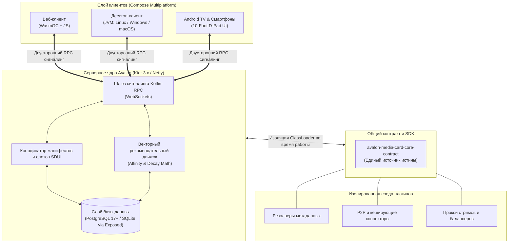

# 📐 Avalon MediaCard — Архитектурное руководство и технический обзор

<p align="center">
  <a href="ARCHITECTURE.md">English</a> • <strong>Русский</strong>
</p>

В данном документе подробно описаны внутренние архитектурные паттерны, топология системы, матрица видеоплееров и инженерные принципы платформы **Avalon MediaCard**.

---

## 🏛️ Высокоуровневая архитектура системы

Платформа Avalon MediaCard построена на принципах **Чистой Архитектуры (Clean Architecture)** в рамках единой кодовой базы на **Kotlin Multiplatform (KMP)**:



---

## 🎬 Универсальная матрица видеоплееров

Традиционные медиасерверы (такие как Plex или Jellyfin) создают колоссальную нагрузку на процессор хоста за счет постоянного транскодирования видео, преобразования аудиодорожек и «впекания» сложных векторных `.ass/.ssa` субтитров.

В Avalon MediaCard реализован иной подход — **архитектура с нулевым транскодированием на сервере**: 100% декодирования и отображения субтитров выполняется на конечном устройстве пользователя через нативные для каждой платформы движки:

| Целевая платформа | Основной движок | Аппаратное ускорение | Отрисовка субтитров | Ключевые возможности |
|---|---|---|---|---|
| **ПК (Desktop)**<br/>*(Linux / Windows / macOS)* | **LibMPV**<br/>*(через JNA C-Interop)* | VAAPI, NVDEC, D3D11VA, VideoToolbox | Нативный пиксель-перфектный ASS/SSA | Прямой JNA-мост к памяти без оверхеда, HDR tone mapping, мгновенное переключение дорожек, поддержка любых кодеков. |
| **Android & Android TV**<br/>*(ТВ, планшеты, смартфоны)* | **AndroidX Media3**<br/>*(ExoPlayer + FFmpeg расширения)* | Android MediaCodec API | Media3 Native + Custom Overlay | **100% оптимизация под пульты (D-Pad)**, Leanback 10-foot интерфейс, встроенные расширения FFmpeg для аудио/видео. |
| **Веб (Web)**<br/>*(WasmGC и современные браузеры)* | **PlaysVideo / Mediabunny**<br/>*(HLS, DASH, MPEG-TS, MP4)* | WebGL / Canvas Direct Draw | WebVTT / ASS.js Canvas | **Внутрибраузерный Wasm-FFmpeg транскодер:** Конвейер в Web Worker преобразует HEVC/AC3/E-AC3/DTS прямо в браузере при **нулевой нагрузке на сервер**. |

---

## 🖥️ Серверный слой (Backend)

* **Фреймворк и транспорт:** **Ktor 3.x** на движке Netty с двунаправленным протоколом **Kotlin-RPC (`kotlinx-rpc`)** поверх WebSockets.
* **База данных и ORM:** SQLite / PostgreSQL 17+ под управлением **JetBrains Exposed ORM**. Все запросы изолированы внутри неблокирующих `newSuspendedTransaction(Dispatchers.IO)`. Вызовы базы данных никогда не блокируют потоки корутин.
* **Математический векторный рекомендательный движок:** Рассчитывает многомерные векторы близости интересов пользователя по жанрам, тегам, режиссерам, актерскому составу, годам выпуска, темпу и настроению. Применяет экспоненциальное затухание для старых просмотров и фактор случайных находок (serendipity) для формирования динамических полок.
* **Движок совместного просмотра (Watch Party):** Управляет комнатами совместного просмотра с компенсацией сетевых задержек, синхронизацией опорных таймкодов (anchor positions) и предстартовым лобби со статусами участников (*«Смотрю молча»*, *«Готов обсуждать»*).

---

## 🧩 Изолированная среда выполнения плагинов

Сервер динамически подгружает плагины из каталога `plugins/` при запуске или «на лету» (hot-reload) через панель администратора:
1. Каждый плагин `.jar` инстанциируется в отдельном дочернем экземпляре `URLClassLoader`.
2. Плагины взаимодействуют с ядром строго через контракт [`avalon-media-card-core-contract`](https://github.com/ensodai/avalon-media-card-core-contract) (интерфейсы `AvalonPlugin`, `PluginContext`).
3. При сбое или неперехваченном исключении в стороннем коде плагин изолируется, предотвращая падение всего сервера.
4. Горячая перезагрузка выгружает ClassLoader старой версии, освобождая ресурсы, и запускает обновленный модуль без обрыва активных воспроизведений.

---

## 📱 Клиентский слой (UI)

* **100% общий граф Compose Multiplatform:** Единая дизайн-система, компоненты и навигация скомпилированы из общего кода для Desktop JVM, Web (WasmGC) и Android.
* **Server-Driven UI (SDUI):** Экраны формируются сервером динамически из узлов-слотов (`HeroBanner`, `Carousel`, `ExploreGrid`, `DetailsView`). Обновления структуры экрана и состояний передаются клиентам в виде реактивных Flow через WebSocket.
* **Опыт 10-Foot TV:** Наэкранный интерфейс Android TV спроектирован с учетом фокусировки пультом (D-Pad кольца фокуса, анимация масштабирования карточек, адаптированные списки эпизодов).

---

## 🛠️ Сборка всей экосистемы из исходного кода

### Системные требования
* JDK 21+ (рекомендуется OpenJDK или Eclipse Temurin)
* Android SDK (build-tools 35+, platform 35) для сборки Android
* Node.js & Yarn (Gradle устанавливает и настраивает их автоматически для таргетов Wasm/JS)

### Команды сборки

```bash
# 1. Клонирование репозитория
git clone https://github.com/ensodai/avalon-media-card.git
cd avalon-media-card

# 2. Настройка конфигурации окружения
cp .env.example .env

# 3. Запуск сервера Ktor
./gradlew :server:run

# 4. Запуск десктопного приложения (JVM)
./gradlew :desktopApp:run

# 5. Сборка релизного APK для Android
./gradlew :androidApp:assembleRelease

# 6. Сборка WebAssembly бандла для браузера
./gradlew :web:wasmJsBrowserDistribution
```

---

## 📚 Связанная документация

* [Основной README](README.ru.md) — Быстрый запуск и пользовательские функции.
* [SDK контракта ядра](https://github.com/ensodai/avalon-media-card-core-contract) — Полная спецификация для разработчиков плагинов, слотов SDUI и клиентов RPC.
