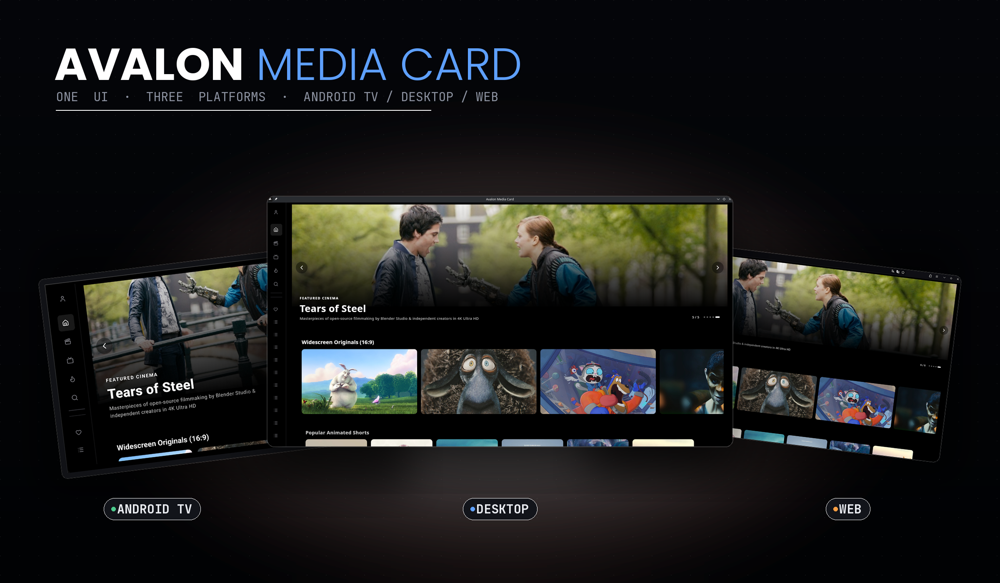
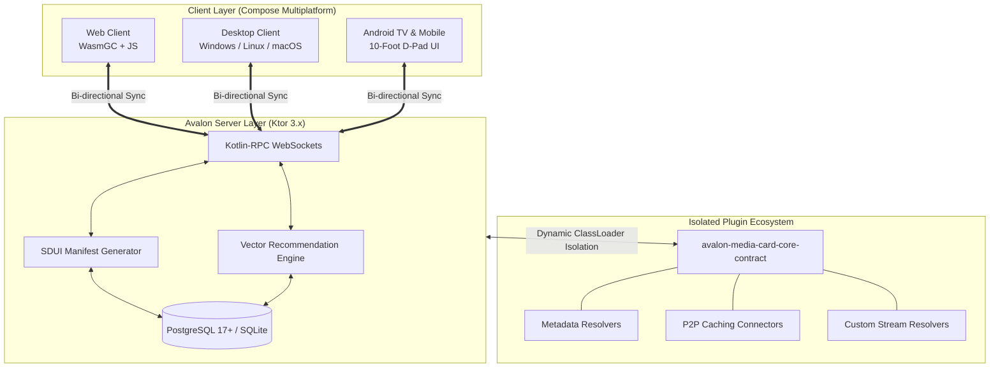
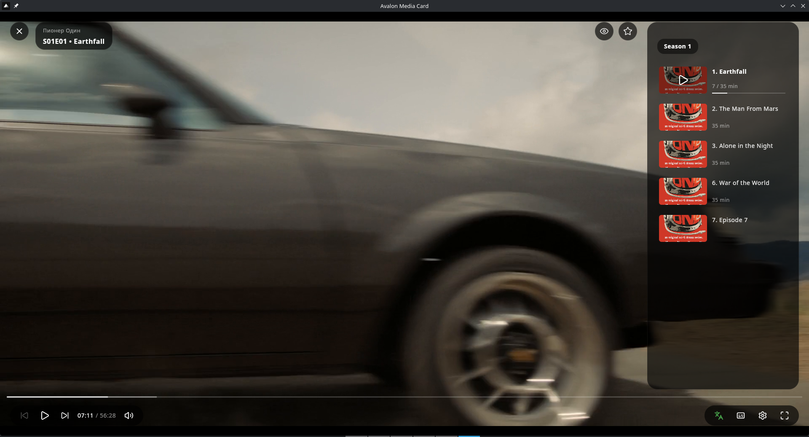
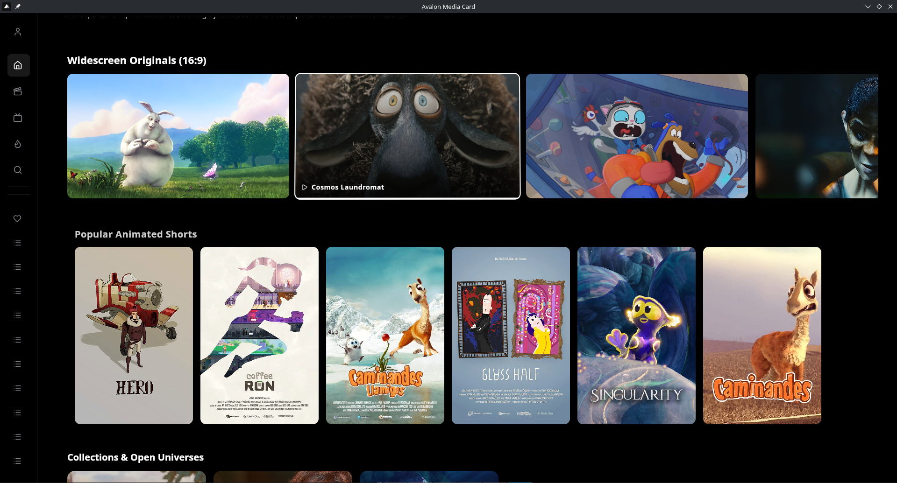
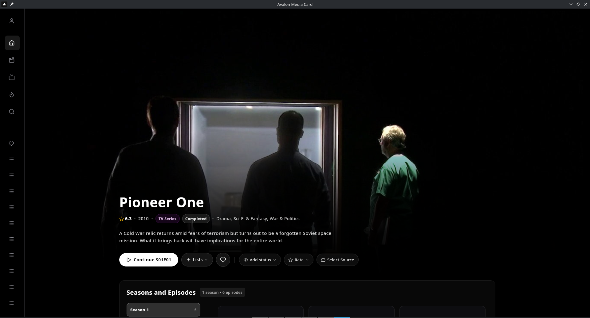
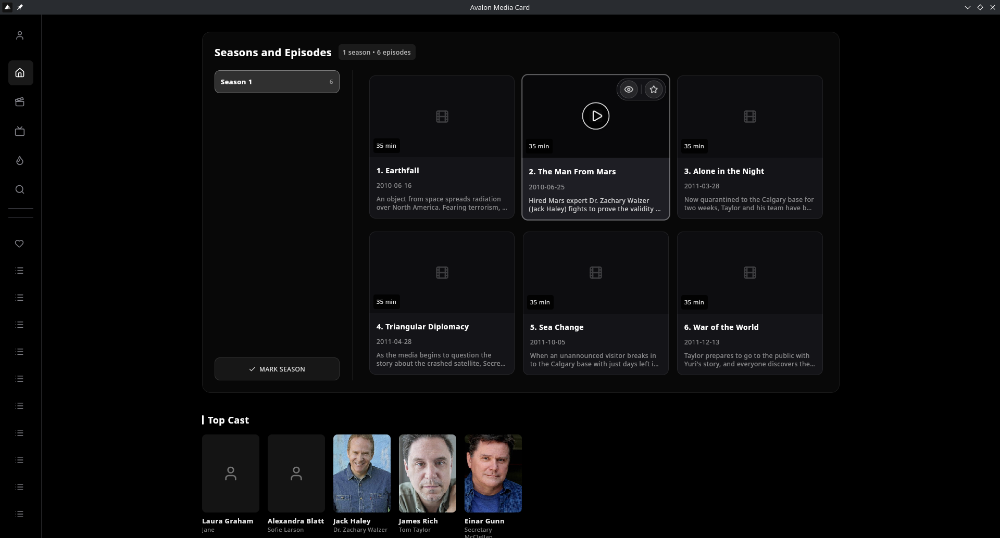
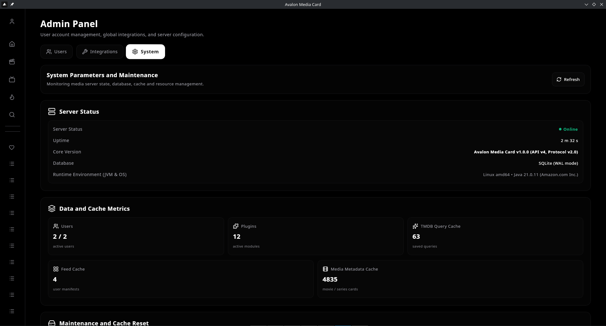
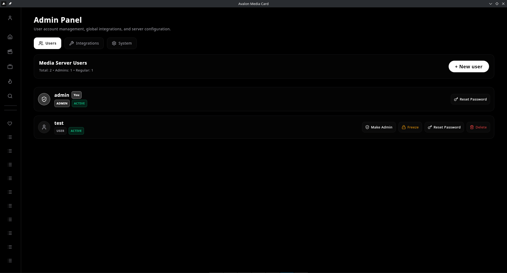

<p align="center">
  
</p>

<h1 align="center">Avalon MediaCard</h1>

<p align="center">
  <strong>Next-Generation Cross-Platform Media Center, Streaming Aggregator & Multi-Engine Playback Ecosystem</strong>
</p>

<p align="center">
  <a href="https://kotlinlang.org/"></a>
  <a href="https://www.jetbrains.com/lp/compose-multiplatform/"></a>
  <a href="https://ktor.io/"></a>
  <a href="https://webassembly.org/"></a>
  <a href="https://github.com/Kotlin/kotlinx-rpc"></a>
  <a href="LICENSE"></a>
  <a href="https://opensource.org/licenses/MIT"></a>
</p>

---

## 🌟 Overview

**Avalon MediaCard** is a modern, high-performance, cross-platform media center and video streaming ecosystem built from the ground up with **Kotlin Multiplatform (KMP)** and **Compose Multiplatform**.

It eliminates cross-platform UI and playback fragmentation by providing a unified **100% shared reactive UI tree** across Desktop, Android TV, and Web, backed by a resilient **Ktor 3.x** server communicating over **Kotlin-RPC WebSockets**, a **Server-Driven UI (SDUI)** architecture, and an isolated **dynamic plugin system**.

<p align="center">
  
</p>

---

## 📐 Architecture & Tech Stack

Avalon MediaCard combines a single declarative UI codebase with deeply optimized, platform-native video rendering pipelines:

* **Language & Compiler:** Kotlin 2.1+ with the **K2 Compiler** enabled for lightning-fast compilation across JVM, Android, and WebAssembly targets.
* **UI Framework:** **Compose Multiplatform** (Android Mobile, 10-Foot Android TV, Desktop JVM for Linux/Windows/macOS, and WasmGC for modern browsers).
* **Backend:** **Ktor 3.x Server** (Netty Engine) with bi-directional **Kotlin-RPC (`kotlinx-rpc`)** over WebSockets.
* **Database & ORM:** SQLite / PostgreSQL 17+ with **JetBrains Exposed ORM** (fully non-blocking suspended DSL & DAO transactions).
* **UI Paradigm:** **Server-Driven UI (SDUI)** — Dynamic screen manifests, real-time slot updates, and discovery shelves pushed from the server.
* **Plugin Architecture:** Dynamic runtime JAR isolation via dedicated `URLClassLoader` instances conforming to the versioned `avalon-media-card-core-contract`.



---

## 🎬 Universal Multi-Engine Video Player Matrix

Video codec compatibility, hardware decoding, and complex vector subtitle rendering (such as styled `.ass/.ssa` anime subtitles) are historical pain points in media centers. Traditional web or mobile clients often force host servers into heavy CPU video transcoding just to burn in subtitles.

Avalon MediaCard solves this by deploying a **Universal Multi-Engine Player Matrix** that selects the optimal playback engine natively on each client:

| Platform | Core Player Engine | Hardware Acceleration | Subtitle Rendering | Key Capabilities |
|---|---|---|---|---|
| **Desktop**<br/>*(Linux / Windows / macOS)* | **LibMPV**<br/>*(via JNA C-Interop)* | VAAPI, NVDEC, D3D11VA, VideoToolbox | Native Pixel-Perfect ASS/SSA | Zero-overhead JNA memory bridging, HDR tone mapping, seamless multi-audio track switching, unlimited codec support. |
| **Android & Android TV**<br/>*(Mobile, Tablet, TV)* | **AndroidX Media3**<br/>*(ExoPlayer + FFmpeg Extensions)* | Android MediaCodec API | Media3 Native + Custom Overlay | **100% D-Pad Remote Optimization**, Leanback 10-foot UI, bundled FFmpeg audio/video extensions, optional LibVLC/MPV fallbacks. |
| **Web**<br/>*(WasmGC & Modern Browsers)* | **PlaysVideo / Mediabunny**<br/>*(HLS, DASH, MPEG-TS, MP4)* | WebGL / Canvas Direct Draw | WebVTT / ASS.js Canvas | **In-Browser Wasm-FFmpeg Transcoder:** Real-time Web Worker pipeline converting HEVC/AC3/E-AC3/DTS directly in browser with **zero server load**. |

<p align="center">
  
</p>

---

## 🚀 Key Features

### 1. 🧠 Mathematical Vector Recommendation Engine (SDUI)
A vector-based recommendation system calculating multi-dimensional user affinity vectors across genres, keywords, directors, actors, era, pacing, and mood. Applies exponential time decay to older viewing habits and introduces serendipity multipliers to generate rich discovery shelves (*"Moods & Tropes"*, *"Hidden Gems"*, *"Because you watched"*).

<p align="center">
  
</p>

### 2. 📺 Native Android TV 10-Foot Experience
Explicitly designed and compiled for television displays with full D-Pad directional focus, smooth scale animations, leanback navigation drawers, and episode selector sheets tailored for remote control ergonomics.

<!-- Placeholder for Android TV GIF -->
<!-- <p align="center"></p> -->

### 3. 📑 Rich Media Hub, Episodes Grid & Cast
Comprehensive media overview screens featuring high-definition backdrops, status management, custom lists, interactive season/episode grids, and full actor filmographies.

<p align="center">
  
</p>

<p align="center">
  
</p>

### 4. 🗄️ Metadata Aggregation & Bring-Your-Own-Key (BYOK)
Seamless integration with **The Movie Database (TMDB)**, **Trakt.tv**, and anime metadata catalogs (Shikimori). Full multi-user support with custom watchlists, episode watch progress tracking, resume points, and personal ratings.

### 5. ⚙️ Admin Control Center & Granular Governance
Dedicated administrator dashboard for multi-tenant user provisioning, access control, cache invalidation, database metrics, and independent configuration cards for metadata providers and stream proxy connectors.

<p align="center">
  
</p>

<p align="center">
  
</p>

### 6. 🔌 Modular Plugin SDK
Dynamic isolated JAR plugin architecture based on `avalon-media-card-core-contract`. Plugins run in sandboxed classloaders with hot-reloading capabilities, ensuring third-party extensions never compromise server stability.

---

## 📦 Quick Start Guide

Avalon MediaCard operates on a client-server architecture: you host the **Server**, and connect to it from your browser or device apps.

### Step 1: Install the Server (Backend)

Run the server on your Linux machine, VPS, or NAS using one of the methods:

#### Option A: 1-Click Linux Script (Recommended)
```bash
bash <(curl -sSL https://raw.githubusercontent.com/ensodai/avalon-media-card/main/scripts/install.sh)
```
*(Interactive prompts will guide you through directory setup, port configuration, and admin credentials).*

#### Option B: Docker Compose
```bash
mkdir -p avalon && cd avalon
curl -fsSL https://raw.githubusercontent.com/ensodai/avalon-media-card/main/docker-compose.yml -o docker-compose.yml
docker compose up -d
```

> 💡 **Server is ready!** A built-in web version is already running at `http://<SERVER_IP>:8080` (Default login: `admin` / `admin`).

---

### Step 2: Connect from Your Devices (Clients)

You can watch media directly in your **Web Browser** at `http://<SERVER_IP>:8080`, or use native client apps for hardware-accelerated playback and TV remote navigation:

1. **Download the app** for your device from [Latest Releases](https://github.com/ensodai/avalon-media-card/releases/latest):
   * 📺 **Android TV & Mobile:** `avalon-android.apk`
   * 🪟 **Windows Desktop:** `avalon-windows.exe` (or `.msi`)
   * 🐧 **Linux Desktop:** `avalon-linux.deb`

2. **Connect to your server:**
   * Open the app or browser.
   * Enter your **Server URL**: `http://<SERVER_IP>:8080`
   * Enter your **Username** and **Password** (default: `admin` / `admin`).
   * Click **Connect** — your media library and settings will sync automatically!

---

### 🛠️ For Developers: Build from Source

To compile the entire Kotlin Multiplatform ecosystem from scratch:

```bash
# 1. Clone repository
git clone https://github.com/ensodai/avalon-media-card.git
cd avalon-media-card

# 2. Configure environment
cp .env.example .env

# 3. Run Ktor Backend
./gradlew :server:run

# 4. Run Desktop App (JVM)
./gradlew :desktopApp:run

# 5. Build Android APK
./gradlew :androidApp:assembleRelease

# 6. Build WebAssembly Distribution
./gradlew :web:wasmJsBrowserDistribution
```

---

## 🧩 Plugin Development SDK

Building custom extensions is straightforward using the `avalon-media-card-core-contract` dependency:

```kotlin
// Example: Implementing a Custom Stream Resolver Plugin
import org.ensodai.avalonmediacard.contract.plugins.AvalonPlugin
import org.ensodai.avalonmediacard.contract.plugins.PluginContext
import org.ensodai.avalonmediacard.contract.model.MediaKey

class CustomStreamPlugin : AvalonPlugin {
    override val id: String = "org.example.customstream"
    override val name: String = "Custom Stream Connector"
    override val version: String = "1.0.0"

    override fun onInitialize(context: PluginContext) {
        context.streams.registerProvider("custom_provider") { mediaKey, season, episode, user ->
            // Custom protocol resolution or local caching connection logic
            listOf(/* StreamSource objects */)
        }
        context.logger.info("CustomStreamPlugin loaded successfully")
    }
}
```

Drop the compiled `.jar` file into the `plugins/` directory and hot-reload via the Admin Dashboard.

---

## 🗺 Roadmap

* [x] **Core:** Compose Multiplatform Web (WasmGC), Desktop (JVM), Android TV & Mobile unification.
* [x] **Backend:** Ktor 3.x + Kotlin-RPC over WebSockets integration.
* [x] **Desktop:** LibMPV JNA engine with VAAPI/NVDEC hardware decoding.
* [x] **Admin:** Granular per-integration settings and independent connection validation.
* [x] **Engine:** Multi-dimensional vector recommendation system with serendipity calculation.
* [ ] **Analytics & Insights:** User viewing statistics dashboard (hours watched for movies & TV shows, top actors/directors, keyword tag clouds, favorite genres breakdown).
* [ ] **TV Show Alerts:** Automated notifications and episode release calendar for tracked series.
* [ ] **Artwork Enhancement:** Fanart.tv API integration for high-definition backgrounds, logos, and clearart.
* [ ] **Trakt.tv Sync:** Full two-way scrobbling, watch history, custom lists, and rating synchronization.
* [ ] **Mobile Landscape UI:** Optimized ergonomics, gesture navigation, and layout adaptations for smartphone horizontal (landscape) orientation.

---

## 🤝 Community & Contributing

Contributions are welcome! Please feel free to submit issues, feature requests, or pull requests:

1. Fork the repository.
2. Create your feature branch (`git checkout -b feature/amazing-feature`).
3. Commit your changes with meaningful commit messages.
4. Push to the branch (`git push origin feature/amazing-feature`).
5. Open a Pull Request.

---

## 📄 License

* **Core Platform & Applications:** Licensed under the [PolyForm Shield License 1.0.0](LICENSE) (Free to use, self-host, and modify; non-compete terms apply).
* **Plugin SDK & Official Plugins:** The [`avalon-media-card-core-contract`](https://github.com/ensodai/avalon-media-card-core-contract) and all base plugins in `basePlugins/` are licensed under the permissive [MIT License](https://opensource.org/licenses/MIT).

---

## ⚖️ Legal Disclaimer & Extensible SDK Notice

**Avalon MediaCard** is strictly engineered as a **Personal Media Extensible SDK and Local Playback Ecosystem**. The core repository provides an empty, modular framework designed to manage and play public domain media (e.g., Blender Foundation Open Movies) and user-owned, legally acquired digital media hosted on personal infrastructure.

Avalon MediaCard does not host, bundle, scrape, index, or distribute any copyrighted media, circumvention devices, or third-party infringement configurations. All dynamic plugins, Peer-to-Peer caching connectors, and metadata resolvers are developed, installed, and maintained independently by the end-user. The developers and maintainers of Avalon MediaCard assume no liability for how users utilize the provided API contracts or custom JAR plugins loaded into their private server instances.

---

<p align="center">
  Crafted with ❤️ using <strong>Kotlin Multiplatform</strong> & <strong>Compose Multiplatform</strong>
</p>
