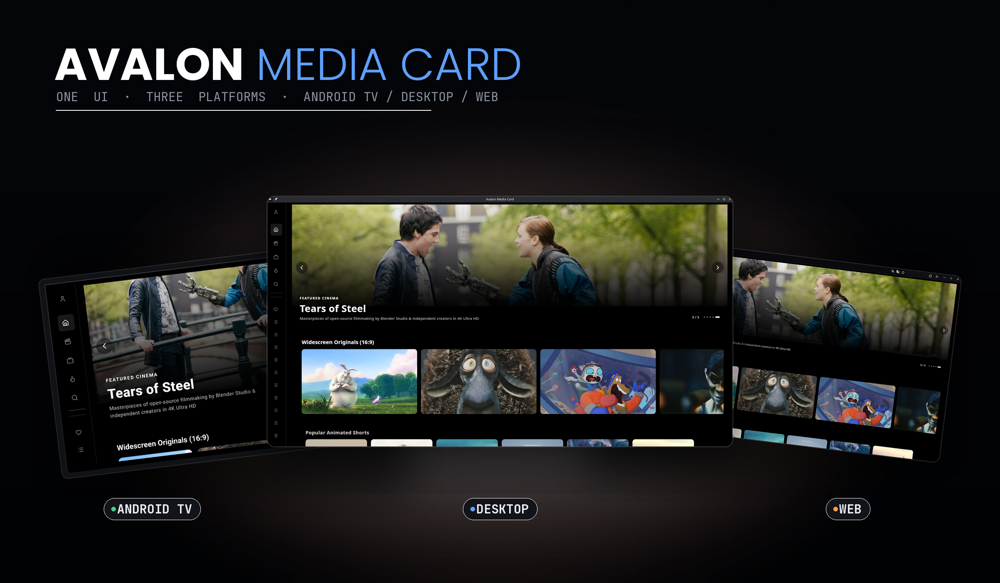

<p align="center">
  
</p>

<h1 align="center">Avalon MediaCard</h1>

<p align="center">
  <strong>A personal online cinema for you and your friends.</strong>
</p>

<p align="center">
  <strong>English</strong> • <a href="README.ru.md">Русский</a>
</p>

<p align="center">
  <a href="https://github.com/ensodai/avalon-media-card/pkgs/container/avalon-media-card"></a>
  <a href="https://github.com/ensodai/avalon-media-card/releases"></a>
  <a href="LICENSE"></a>
  <a href="https://opensource.org/licenses/MIT"></a>
</p>

---

<p align="center">
  
</p>

## 🌟 About the Project

**Avalon MediaCard** is a modern, self-hosted media platform that brings movies, TV series, and anime together into a single, minimalist interface.

The application runs directly in your web browser without requiring third-party software, while also providing dedicated native apps for Smart TVs (Android TV), desktop computers (Windows, macOS, Linux), and mobile devices. Unlike conventional monolithic media servers, Avalon is built specifically for efficiency: the server backend runs comfortably on budget VPS instances, home servers, or single-board computers like the Raspberry Pi.

---

## ✨ Key Features

* 🚀 **Instant Playback Without Downloading:** Video playback starts immediately upon connecting to hybrid sources (CDN or P2P). No need to wait for gigabytes of files to download to your server disk.
* 🍿 **Watch Party (Co-Viewing):** Watch media in tight sync with your friends, wherever they are. The built-in pre-launch lobby lets participants set mood/intent statuses (*"Quiet viewing, no pauses"* or *"Ready to discuss"*) and confirm readiness before playback begins.
* 🧠 **Smart & Private Recommendations:** An embedded vector math engine analyzes personal preferences to surface relevant content. Crucially, all watch history and analytics stay **strictly on your private server** and are never sent to third-party cloud services.
* 👥 **Isolated User Profiles:** Every viewer has their own independent home feed, personal ratings, episode progress tracking, and watch history.
* 📺 **Seamless Across All Displays:** A unified, responsive interface tailored for mouse/keyboard on desktop and optimized for Smart TV remote controls (100% responsive D-Pad navigation without lag).

---

## ⚡ Quick Start (Docker Installation)

The recommended, robust way to host Avalon MediaCard is via **Docker Compose**. This ensures that all user accounts, settings, and media progress persist across server updates and restarts.

### Option 1: One-Line Terminal Command

```bash
mkdir -p avalon && cd avalon
curl -fsSL https://raw.githubusercontent.com/ensodai/avalon-media-card/main/docker-compose.yml -o docker-compose.yml
docker compose up -d
```

### Option 2: For Portainer, Dockge, or Manual Setup

If you manage containers through web dashboards or configure stacks manually, use this `compose.yaml`:

```yaml
services:
  avalon-server:
    image: ghcr.io/ensodai/avalon-media-card:latest
    container_name: avalon-media-card
    restart: unless-stopped
    ports:
      - "8080:8080"
    volumes:
      - ./data:/app/data
      - ./plugins:/app/plugins
```

### First Login

Open your web browser and navigate to:
`http://localhost:8080` *(or your server's local LAN IP)*.

Default administrator credentials:
* **Username:** `admin`
* **Password:** `admin`

> ⚠️ **Important:** Change the administrator password immediately upon your first login and create separate accounts for family members or friends in the management panel.

---

## 📱 Client Applications

You can access your library directly via the web browser or through native client builds:

* 📺 **Android TV / Android Mobile:** download `avalon-android.apk` from [Latest Releases](https://github.com/ensodai/avalon-media-card/releases/latest).
* 💻 **Desktop PC:** installable builds for Windows (`.exe` / `.msi`) and Linux (`.deb` / AppImage).
* 🌐 **Web Client:** served directly by the backend at `http://<SERVER_IP>:8080`.

To connect, launch the app, enter your server address `http://<SERVER_IP>:8080`, and log in with your credentials.

---

<details>
<summary>🔌 <b>Optional: Online Stream Balancers Integration (Lampac / Accsdb)</b></summary>

The `lampac-adapter-plugin` allows connecting your Avalon server to a [Lampac](https://github.com/lampac-nextgen/lampac) gateway for online video balancer streams.

If Lampac has **Accsdb** authentication enabled, Avalon sends account credentials with each request.

#### 1. Lampac Setup (`init.conf`)

Add a dedicated account for Avalon:
```json
"accsdb": {
  "enable": true,
  "accounts": {
    "avalon": "2040-10-17T00:00:00"
  }
}
```
*(Or via Lampac Admin → **Users** → Add user with ID `avalon`).*

Or use a shared password (`shared_passwd`):
```json
"accsdb": {
  "enable": true,
  "shared_passwd": "your_shared_secret"
}
```

#### 2. Avalon Environment Variables

Configure environment variables in the `environment` section of your `docker-compose.yml`:

| Variable | Required | Description |
|---|---|---|
| `LAMPAC_HOST` | Recommended | Lampac base URL, e.g. `http://192.168.1.10:9118` (default `http://localhost:9118`) |
| `LAMPAC_UID` | If Accsdb is enabled | Accsdb account ID / personal password (passed as `?uid=`) |
| `LAMPAC_TOKEN` | Optional | Passed as `?token=` |
| `LAMPAC_ACCOUNT_EMAIL` | Optional | Passed as `?account_email=` (also used with `shared_passwd`) |

Example in `docker-compose.yml`:
```yaml
    environment:
      - LAMPAC_HOST=http://lampac:9118
      - LAMPAC_UID=avalon
```

If Accsdb is disabled on your Lampac instance, you do not need to set `LAMPAC_UID`, `LAMPAC_TOKEN`, or `LAMPAC_ACCOUNT_EMAIL`.

</details>

---

<details>
<summary>🛠️ <b>Under the Hood: Architecture for Developers & Geeks</b></summary>

### Core Technology Stack

* **Ultra-Lightweight Signaling Server:** Backend built with **Kotlin 2.1+ / Ktor 3.x (Netty)**. Acts as an API coordinator, database manager (SQLite / PostgreSQL with JetBrains Exposed ORM), and WebSocket signaling gateway powered by **kotlinx-rpc**.
* **Client-Side Video Rendering:** Unlike Plex or Jellyfin, Avalon does not exhaust server CPUs with continuous real-time video transcoding. Heavy decoding and vector subtitle rasterization are performed directly on the client using **LibMPV** (Desktop JNA), **AndroidX Media3** (Android TV/Mobile), or in-browser **WasmGC + FFmpeg** pipelines.
* **Server-Driven UI (SDUI):** Dynamic user interfaces powered by **Compose Multiplatform**. Content carousels, dynamic shelves, and screen structures are streamed reactively from the backend.
* **Isolated Plugin SDK:** Sandboxed JAR plugin runtime based on the [`avalon-media-card-core-contract`](https://github.com/ensodai/avalon-media-card-core-contract) specification with custom `ClassLoader` isolation and hot-reload support.

### Building from Source

```bash
# Clone the repository
git clone https://github.com/ensodai/avalon-media-card.git
cd avalon-media-card

# Setup environment
cp .env.example .env

# Run Ktor backend
./gradlew :server:run

# Run Desktop client (JVM)
./gradlew :desktopApp:run

# Build Android APK
./gradlew :androidApp:assembleRelease

# Build WebAssembly distribution
./gradlew :web:wasmJsBrowserDistribution
```

> 📖 For full system topology, multi-engine player matrix, and engineering deep-dive, see **[ARCHITECTURE.md](ARCHITECTURE.md)**.

</details>

---

## 📜 Licensing

* **Core Platform & Applications:** Licensed under the [PolyForm Shield License 1.0.0](LICENSE) (Free to use, self-host, and modify for personal use; commercial non-compete provisions apply).
* **Plugin SDK & Official Plugins:** The [`avalon-media-card-core-contract`](https://github.com/ensodai/avalon-media-card-core-contract) and base plugins in `basePlugins/` are licensed under the permissive [MIT License](https://opensource.org/licenses/MIT).

---

## ⚖️ Legal Disclaimer & Extensible SDK Notice

**Avalon MediaCard** is strictly engineered as a **Personal Media Extensible SDK and Local Playback Ecosystem**. The core repository provides a modular, empty framework designed to organize and play public domain media (e.g., Blender Foundation Open Movies) and legally acquired personal media files hosted on the user's private infrastructure.

The Avalon MediaCard software does not host, bundle, index, scrape, or distribute copyrighted media, DRM circumvention mechanisms, or third-party infringement configurations. All external dynamic plugins, P2P caching connectors, and metadata resolvers are independently developed, installed, and configured by the end-user at their own discretion. The developers, maintainers, and contributors of Avalon MediaCard assume no legal liability for how users utilize the provided open API contracts or which third-party extensions are loaded into private server instances.
